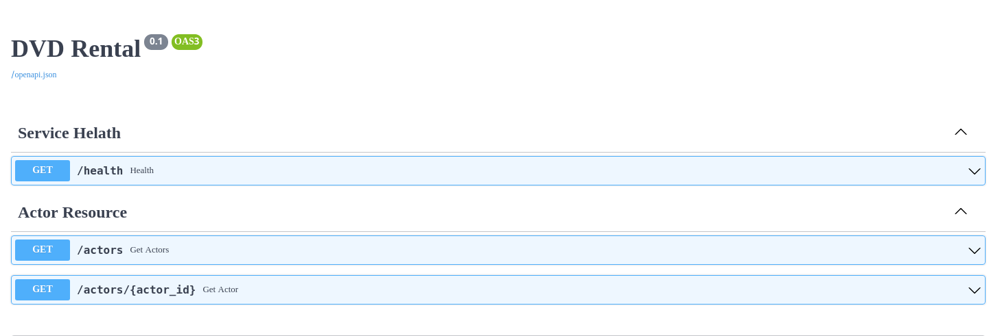
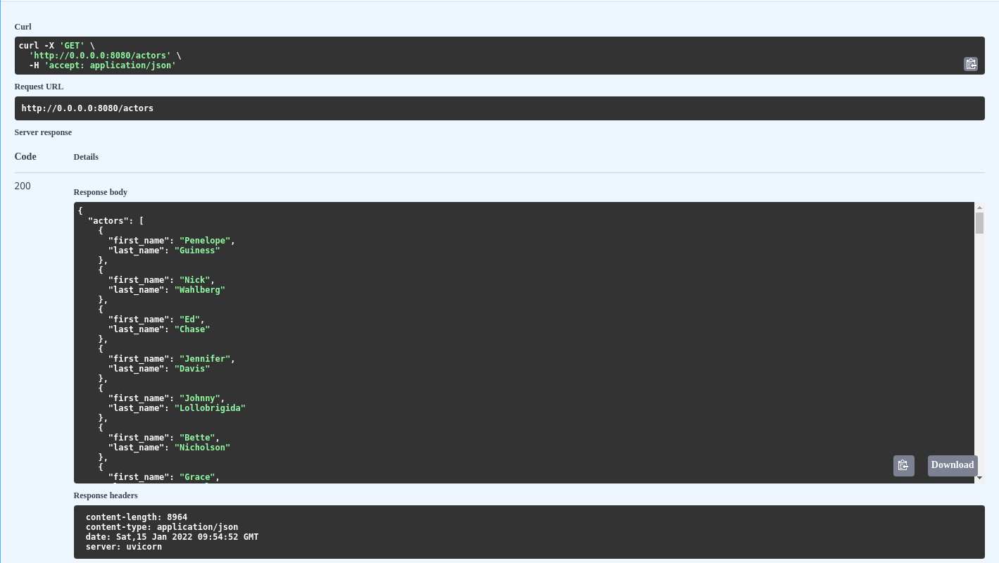
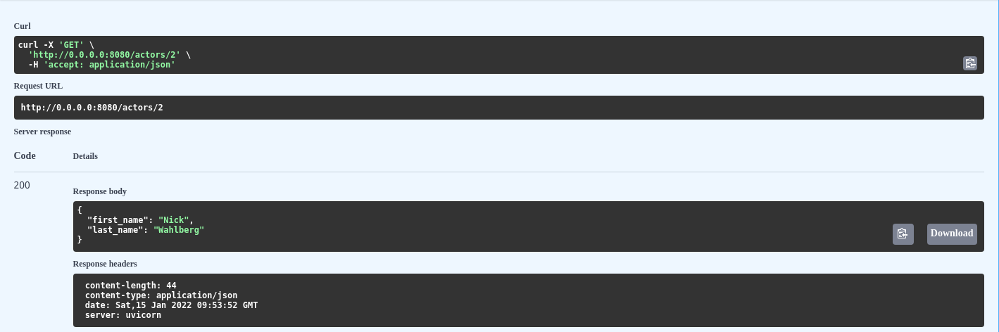

## DVD Rental Backend

Recently, I have started reading "Architectures Patterns with Python" book(which is also available online [here](https://www.cosmicpython.com/book/preface.html)). In the book, the author uses django for the examples.
As I am more familiar with fastapi, I wanted to implement the "Repository Pattern" in FastApi application with currently available packages.
I learned the "Repository Pattern" concept from the book, and followed [this](https://rogulski.it/blog/sqlalchemy-14-async-orm-with-fastapi/) great blog post
to implement the pattern with my setup.

I used a [sample database](https://www.postgresqltutorial.com/load-postgresql-sample-database/) provided by [PostgreSQL Tutorial](https://www.postgresqltutorial.com/).

**NOTE:** This is not a totally completed application. This is an implementation to check my understanding of the concept.
Even then I tried to follow many practices and will try to do other experiments here.

### "/app" directory structure.
```bash
.
├── db
│   ├── repositories
│   ├── schemas
│   └── tables
├── dtos
│   ├── requests
│   └── responses
├── exceptions
│   ├── exception_messages
│   └── services
├── routes
├── services
│   ├── implementations
└── utils
```
## Examples(Screenshots):

**Swagger Overview**


**/actors Endpoint**


**/actors/{actor_id} Endpoint**



### TODO List:
[] ...

[] ...

[] ...

...

# Learning Resources:

### FastApi

- [Building a CRUD App with FastAPI and MongoDB](https://testdriven.io/blog/fastapi-mongo/)

- [FastAPI with SQLAlchemy, PostgreSQL and Alembic and of course Docker [Part-1]](https://ahmed-nafies.medium.com/fastapi-with-sqlalchemy-postgresql-and-alembic-and-of-course-docker-f2b7411ee396)

- [SqlAlchemy 1.4 async ORM with FastAPI](https://rogulski.it/blog/sqlalchemy-14-async-orm-with-fastapi/)

- [The Ultimate FastAPI Tutorial Part 7 - Database Setup with SQLAlchemy and Alembic](https://christophergs.com/tutorials/ultimate-fastapi-tutorial-pt-7-sqlalchemy-database-setup/)

### Pytest
- [async test patterns for Pytest](https://tonybaloney.github.io/posts/async-test-patterns-for-pytest-and-unittest.html)

### PostgreSQL

- [PostgreSQL Tutorial](https://www.postgresqltutorial.com/)
